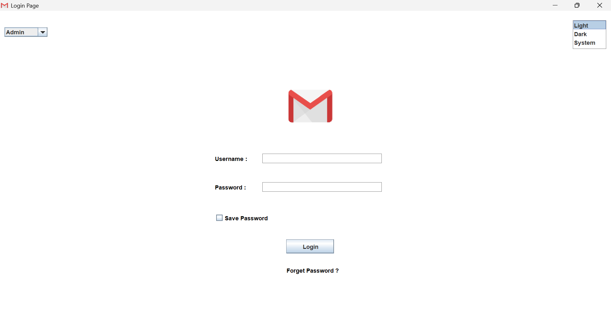
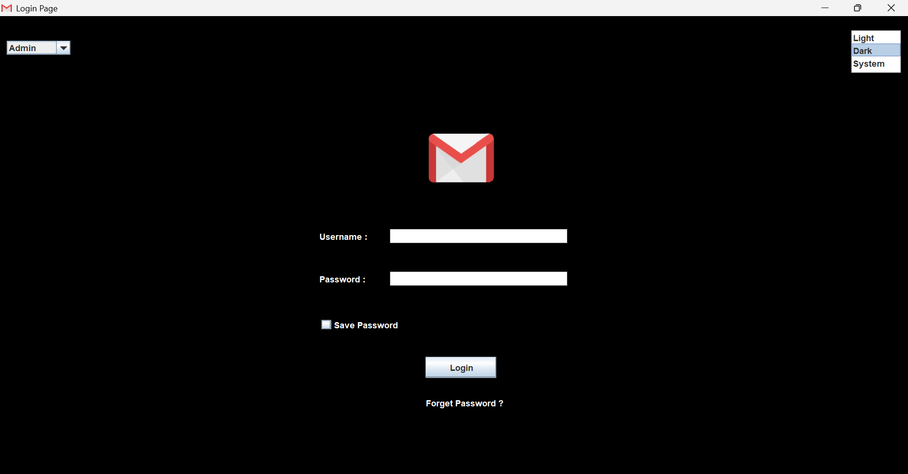

# 📧 Gmail GUI Project

A simple Java Swing desktop application that simulates a Gmail login interface with basic UI features and theme switching.

---

## ✨ Features

- 🔐 Username & Password input fields
- ☑️ "Save Password" checkbox
- 🔘 Login button
- ❓ "Forget Password" clickable label
- 🎨 Theme switcher:
  - Light Mode
  - Dark Mode
  - System Default
- 👤 Role selection using JComboBox (Admin / Student / Instructor)
- 🖼️ Gmail logo displayed in the UI

---

## 🛠️ Technologies Used

- Java
- Swing (GUI)
- AWT

---

## 🛠️ Components Implemented

In this project, I explored and implemented the following **Swing Components**:

| Component | Description |
| :--- | :--- |
| **`JFrame`** | The main window container with a custom title and icon. |
| **`JPanel`** | A mini-container used to organize elements with an **Absolute Layout**. |
| **`JTextField`** | Input field for usernames. |
| **`JPasswordField`** | Secure input field that masks characters for passwords. |
| **`JButton`** | Interactive login button. |
| **`JLabel`** | Used for static text (Username/Password labels) and displaying images. |
| **`JCheckBox`** | "Save Password" feature implementation. |
| **`JComboBox`** | Dropdown menu for selecting user roles (Admin, User, Register). |
| **`JList`** | Selection list for choosing languages (English/Arabic). |
| **`ImageIcon`** | Handling and scaling external images (e.g., Gmail icon). |

---

## 📸 Preview

<p align="center">
  
  
</p>

---

## 📂 How to Run

1. Clone the repository:
```bash
git clone https://github.com/Mai-Elbishlawy/Gmail-GUI.git
